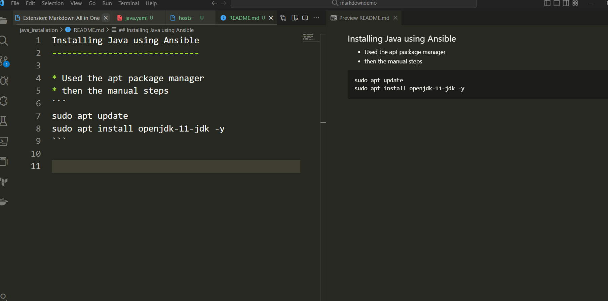

Installing Java using Ansible
-----------------------------

* Used the apt package manager
* then the manual steps
```
sudo apt update
sudo apt install openjdk-11-jdk -y
```




* The manual steps are from [Refer Here](https://directdevops.blog)


## Installing dotnet
1.  sdfds
2.  jksadfna
3.  klsajflkas
4.  
